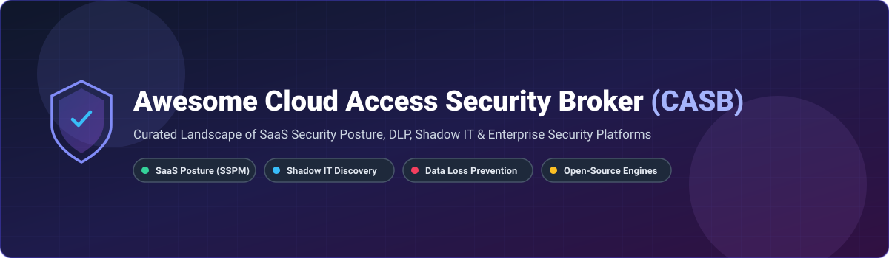

# 🛡️ Awesome Cloud Access Security Broker (CASB) Ecosystem

  

  
  
  
  
  

---

## 📌 Top Cloud Access Security Broker (CASB) Platforms & Ecosystem

**A Curated List of Enterprise SaaS Products & Open-Source Cloud Security Tools**

*Focused on Shadow IT Discovery, Data Loss Prevention (DLP), SaaS Security Posture Management (SSPM), Threat Protection & Zero Trust Cloud Access.*

📅 **Last updated:** September 2026

---

### 🔍 Overview & Market Insight

This repository tracks notable **SaaS platforms** and **open-source projects** for **Cloud Access Security Brokers (CASB)**. CASB solutions enable security operations, compliance officers, and IT admins to gain complete visibility into SaaS and cloud application usage, enforce granular data loss prevention (DLP) policies, discover unsanctioned shadow IT apps, and secure sensitive enterprise data across managed and unmanaged devices.

#### 📊 Market Size & Industry Structure
> 💡 **Market Size Estimate:** The global Cloud Access Security Broker (CASB) market is estimated at **$10.5 Billion - $12.8 Billion in 2026** (growing at a CAGR of ~18.5%).
>
> 🌐 **Market Structure:** The CASB market is **highly concentrated** (dominated by major cybersecurity consolidators and SSE/SASE vendors like Microsoft, Palo Alto Networks, Broadcom, Cisco, and Zscaler). Pure-play standalone CASB vendors are largely consolidated into broader Security Service Edge (SSE) platforms.

---

## 📑 Table of Contents

- [🏢 SaaS/Hosted CASB Platforms](#-saashosted-casb-platforms)
- [💻 Open-Source GitHub Projects & Building Blocks](#-open-source-github-projects--building-blocks)
- [🤝 How to Contribute](#-how-to-contribute)
- [⚠️ Disclaimer](#%EF%B8%8F-disclaimer)
- [☕ Support & Community](#-support--community)
- [📈 Star History](#-star-history)

---

## 🏢 SaaS/Hosted CASB Platforms

> **SaaS Product Preferences & Pricing Disclosure**: Pricing models listed represent standard entry-level tier costs based on public enterprise quotes. Free trial limits detail forever-free tiers or trial duration/seat constraints. Enterprise valuation/revenue figures reflect parent companies or public market capitalizations sorted in descending order.

| Platform | Valuation / Company Size (Revenue/Valuation) | Starting Pricing (Per User / Mo) | Free Tier / Trial Limit | Key CASB Features & Focus Areas |
| :--- | :--- | :--- | :--- | :--- |
| **[Microsoft Defender for Cloud Apps](https://learn.microsoft.com/en-us/defender-cloud-apps/)** 🏢 | **$3.12 Trillion** Market Cap ($245B+ Rev) | **$3.50 / user / month** (Stand-alone or via M365 E5 / EMS E5) | **90-Day Free Trial** (up to 25 licenses in Microsoft 365 trial) | Full-featured CASB integrated into Microsoft Defender XDR. Offers shadow IT discovery, SSPM, CIS benchmarks, App-to-App OAuth protection, Copilot Studio AI agent security, and Purview sensitivity labels integration. |
| **[Broadcom CloudSOC](https://techdocs.broadcom.com/)** 💼 | **$820 Billion** Market Cap ($51B+ Rev) | **$6.00 / user / month** (Symantec Enterprise Suite add-on) | **30-Day Free Trial** (enterprise proof-of-concept upon sales request) | Symantec CloudSOC CASB engine featuring Gatelets (inline SaaS inspection), Securlets (API connectors), and Cloud Detection Service (CDS) for enterprise DLP policies. |
| **[Palo Alto Prisma SaaS](https://www.paloaltonetworks.com/)** 🔒 | **$115 Billion** Market Cap ($8.0B+ Rev) | **$8.00 / user / month** (CASB-X standalone bundle) | **30-Day Free Trial** (Strata Cloud Manager evaluation environment) | CASB built into Prisma Access. Features inline SaaS security, real-time API scanning, SSPM posture security, Enterprise DLP, and behavior threat analytics. |
| **[Cisco Cloudlock](https://www.cisco.com/)** 🌐 | **$195 Billion** Market Cap ($538B+ Rev) | **$3.20 / user / month** (Enterprise Agreement starting minimum) | **14-Day Free Trial** (API connection test drive up to 50 accounts) | API-native CASB for SaaS applications. Features user risk anomaly detection (impossible travel), continuous DLP monitoring, and Apps Firewall with Community Trust Ratings. FedRAMP ATO certified. |
| **[Zscaler CASB](https://www.zscaler.com/)** 🛡️ | **$30 Billion** Market Cap ($2.1B+ Rev) | **$5.00 / user / month** (Zscaler Business Edition tier) | **30-Day Free Trial** (Zscaler Zero Trust Exchange evaluation) | Multi-mode inline & API CASB within Zscaler SSE platform. Full TLS/SSL inspection, shadow IT blocking, out-of-band data-at-rest API scanning, and inline cloud sandbox filtering. |
| **[Forcepoint ONE CASB](https://www.forcepoint.com/)** ⚔️ | **$3.0 Billion** Valuation (Private - Francisco Partners) | **$4.50 / user / month** (Forcepoint ONE base user suite) | **30-Day Free Trial** (full-feature cloud tenant sandbox evaluation) | Unified CASB with inline reverse proxy and API inspection, agentless BYOD application access, 190+ built-in DLP compliance templates, and 99.99% AWS uptime SLA. |
| **[Netskope](https://www.netskope.com/)** 🚀 | **$8.8 Billion** Market Cap / Valuation ($899M+ ARR) | **$4.00 / user / month** (Base SWG + CASB starting quote) | **14-Day Free Trial** (Netskope Private Access / CASB Test Drive) | Market-leading CASB in Netskope One SSE. Features inline and API modes, generative AI app risk scoring, 80,000+ app Cloud Confidence Index (CCI), UEBA, and zero-trust proxy. |
| **[Skyhigh Security](https://www.skyhighsecurity.com/)** ☁️ | **$1.8 Billion** Valuation (Private - Symphony Technology Group) | **$4.20 / user / month** (Enterprise Cloud Protection Suite) | **14-Day Free Trial** (Skyhigh Cloud Registry test suite) | Enterprise CASB featuring Cloud Registry (261-point risk scoring across cloud apps), Autonomous Remediation, inline reverse proxy, and near real-time (10-15s) API DLP scanning. |
| **[Lookout CASB](https://www.lookout.com/)** 📱 | **$1.5 Billion** Valuation (Private) | **$3.80 / user / month** (Lookout Cloud Security Platform) | **30-Day Free Trial** (Secure Cloud Access evaluation portal) | Secure Cloud Access CASB with native DRM policies (data masking, watermarking, dynamic encryption), zero-day Cloud Sandbox, dynamic external sharing remediation, and DSPM/SSPM. |
| **[Bitglass](https://www.bitglass.com/)** ⚡ | **$500 Million** Valuation (Acquired by Forcepoint / STG) | **$3.50 / user / month** (Agentless CASB Core package) | **14-Day Free Trial** (Agentless reverse-proxy demo tenant) | Agentless multi-mode CASB (API, reverse proxy, SmartEdge SWG on-device decryption). Uniquely combines CASB, SWG, and ZTNA for unmanaged BYOD devices. |

---

## 💻 Open-Source GitHub Projects & Building Blocks

> 💡 **Open-Source Landscape Reality**: Production CASB platforms are among the most commercially consolidated cybersecurity categories. No single open-source repository matches full enterprise-scale inline proxies or multi-SaaS API coverage. The projects below represent complete engines, educational foundations, and essential building blocks sorted by GitHub_Stars (descending).

| Project & Repository | GitHub_Stars | Description & Focus |
| :--- | :--- | :--- |
| **[prowler-cloud/prowler](https://github.com/prowler-cloud/prowler)** 🌟 |  | **SSPM & CSPM Engine**. Premier open-source security posture management tool for AWS, Azure, GCP, and Kubernetes. Provides automated compliance scanning (CIS, NIST, HIPAA) and SaaS posture auditing. |
| **[zaproxy/zaproxy](https://github.com/zaproxy/zaproxy)** 🛠️ |  | **OWASP ZAP API & Web Proxy**. World's most widely used web application and API security scanner. Used in custom CASB stacks to intercept, audit, and proxy SaaS traffic and web APIs. |
| **[nccgroup/ScoutSuite](https://github.com/nccgroup/ScoutSuite)** 🔍 |  | **Multi-Cloud Posture Auditor**. Python-based multi-cloud security auditing tool that queries cloud provider APIs to expose posture risks, unencrypted assets, and access control gaps. |
| **[NightfallAI/sensitive-data-scanner](https://github.com/NightfallAI/sensitive-data-scanner)** 🔐 |  | **Open DLP Scanner Engine**. Core data loss prevention engine for detecting PII, PHI, PCI, and secret credentials across plain text, code, and documents before cloud upload. |
| **[ReliableSecurity/cloud-security-broker](https://github.com/ReliableSecurity/cloud-security-broker)** 🛡️ |  | **Most Complete Open-Source CASB Engine**. Production-ready Cloud Security Broker featuring DLP file auto-encryption, MFA integration, anomaly monitoring alerts, and API resource auditing. Supports Yandex Cloud, SberCloud, Mail.ru, with AWS/Azure under active development. |
| **[pleno-dlp/pleno](https://github.com/pleno-dlp/pleno)** 📄 |  | **Multi-Format DLP Engine**. High-speed secret scanning and PII detection engine outputting standard SARIF reports for continuous CASB pipeline integration. |
| **[Tanitay/Cloud-Access-Security-Broker-Project](https://github.com/Tanitay/Cloud-Access-Security-Broker-Project)** 🎓 |  | **CASB Research & Learning Architecture**. Educational reference architecture exploring cloud data loss protection, user behavior threat detection, and proxy access control for AWS & GCP. |

---

## 🤝 How to Contribute

Contributions, new tool suggestions, and pull requests are very welcome! 🚀

1. 🍴 **Fork** the repository.
2. 📝 **Add or edit** entries in `README.md` (keep descriptions factual, concise, and formatted within the tables).
3. 🔗 Ensure all links lead directly to official product sites or GitHub repos.
4. 📬 **Submit a Pull Request** with a clear explanation of your additions.

---

## ⚠️ Disclaimer

- This list is **community-curated** for educational, architectural, and security evaluation purposes — it does not constitute an endorsement.
- CASB platforms process enterprise traffic and sensitive credentials; ensure full compliance with regional privacy laws (GDPR, CCPA, HIPAA) and cloud provider terms.

---

## ☕ Support & Community

If you find this repository helpful, please consider showing your support:

- ⭐ **Star** this repository to help others discover it.
- 🔀 **Fork** it to contribute improvements or maintain your own list.
- 📢 **Share** it with fellow cloud security architects, SOC analysts, and DevSecOps engineers!
- 💖 **Sponsor the Project:** Buy me a coffee via [GitHub Sponsors Dashboard](https://github.com/sponsors/ishandutta2007)!

---

## 📈 Star History

---

  <b>Made with ❤️ for Cloud Security Architects, SOC Analysts, Data Protection Officers & DevSecOps Teams.</b>

